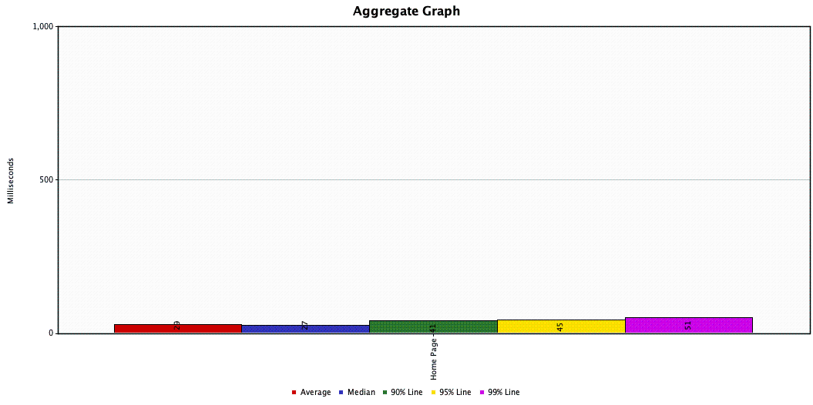

# Fabric-java-spring
This is a sample code for a spring boot http server invoke Fabric network as data source.

As "Greetings from Spring Boot! " + query A from first network(90) from `byfn`

It tested via jmeter for performance. (about 1 min due to my laptop)

Tested as
## noPoolNoCache

It has 46.4% Error rate, as IO exception.

| Label     | \# Samples | Average | Median | 90% Line | 95% Line | 99% Line | Min | Max    | Error %  | Throughput | Received KB/sec | Sent KB/sec |
|-----------|------------|---------|--------|----------|----------|----------|-----|--------|----------|------------|-----------------|-------------|
| Home Page | 2510       | 568     | 116    | 162      | 206      | 412      | 64  | 111377 | 46\.414% | 17\.27770  | 4\.17           | 2\.00       |
| TOTAL     | 2510       | 568     | 116    | 162      | 206      | 412      | 64  | 111377 | 46\.414% | 17\.27770  | 4\.17           | 2\.00       |

## PoolNoCache

No Error and looks good. Http server with 318 tps.

| Label     | \# Samples | Average | Median | 90% Line | 95% Line | 99% Line | Min | Max | Error % | Throughput | Received KB/sec | Sent KB/sec |
|-----------|------------|---------|--------|----------|----------|----------|-----|-----|---------|------------|-----------------|-------------|
| Home Page | 19122      | 29      | 28     | 42       | 46       | 51       | 12  | 63  | 0\.000% | 318\.58849 | 59\.73          | 38\.27      |
| TOTAL     | 19122      | 29      | 28     | 42       | 46       | 51       | 12  | 63  | 0\.000% | 318\.58849 | 59\.73          | 38\.27      |

## PoolCache

Use a cache as random (0,5) and when number>4 we miss the cache 

| Label     | \# Samples | Average | Median | 90% Line | 95% Line | 99% Line | Min | Max | Error % | Throughput   | Received KB/sec | Sent KB/sec |
|-----------|------------|---------|--------|----------|----------|----------|-----|-----|---------|--------------|-----------------|-------------|
| Home Page | 1710545    | 0       | 0      | 1        | 1        | 1        | 0   | 520 | 0\.000% | 28510\.98407 | 5337\.74        | 3563\.87    |
| TOTAL     | 1710545    | 0       | 0      | 1        | 1        | 1        | 0   | 520 | 0\.000% | 28510\.98407 | 5337\.74        | 3563\.87    |

